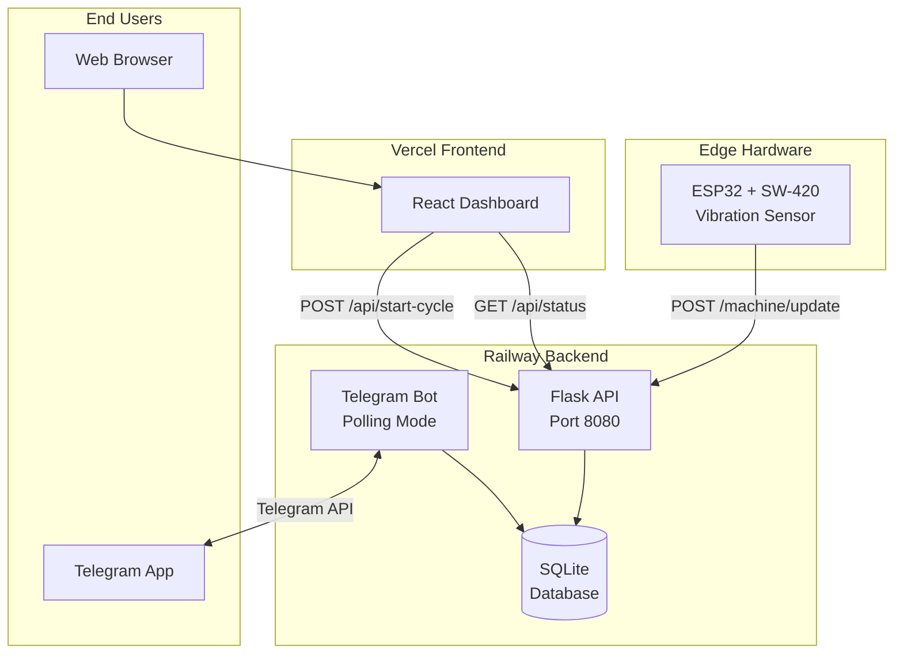

# UWash - Hackathon Submission Materials

## 1. Project Description (DevPost)

### Project Name
**UWash – Real-time Laundry Intelligence for UTown Residences**

### Problem Statement
Laundry is a universal pain point in residential life. Students often trek across several floors with heavy baskets only to find all machines occupied. Conversely, machines left idle with finished laundry prevent others from using them, leading to friction between residents and wasted time. Existing "manual" tracking systems (like Telegram groups) rely on human honesty.

### Our Solution
UWash is an automated hardware-plus-software ecosystem. We use vibration sensors (SW-420) attached to physical washing machines to detect real-time usage. This data is instantly synced to a Cloud Backend (Railway), accessible via a **Live Web Dashboard** for quick checks and a **Telegram Bot** that sends proactive notifications when your laundry is done.

### How It Works (Technical Overview)
- **Edge Hardware**: ESP32 microcontrollers equipped with SW-420 vibration sensors. We use a rolling-window algorithm to filter out accidental bumps and confirm machine operation.
- **Backend Infrastructure**: A Flask API hosted on Railway, utilizing SQLite for persistent data storage and Railway Volumes for data integrity during redeployments.
- **Communication**: Hardware communicates via RESTful API (POST requests) secured with API keys.
- **User Interfaces**:
  - *Telegram Bot*: Built with python-telegram-bot, utilizing Asynchronous Polling for real-time user interaction.
  - *Frontend Dashboard*: A React/Vercel web app that fetches live status via a `GET /api/status` endpoint.

### Impact & Feasibility
- **Impact**: Reduces "laundry anxiety" and saves students an average of 15–20 minutes per laundry cycle by eliminating unnecessary trips.
- **Feasibility**: Highly feasible. The hardware cost is <$15 per machine, and the system can be retrofitted to any existing laundry brand without internal wiring, making it campus-compliant.

---

## 2. Demo Video Script (3 Minutes)

### Scene 1: The Problem (0:00 - 0:45)
**Visual**: Someone walking with a heavy laundry basket, reaching a laundry room, seeing it full, and sighing.

**Script**:
> "We've all been there. You carry your laundry down three floors, only to find every machine is taken. Or worse—someone's clothes have been sitting in a finished machine for two hours. In UTown, laundry shouldn't be a guessing game."

### Scene 2: The Solution - Hardware (0:45 - 1:30)
**Visual**: Close up of the ESP32 and sensor taped to a machine. Show it shaking.

**Script**:
> "Meet UWash. Our solution starts here, with this low-cost vibration sensor. It 'feels' when the machine is running. Using an ESP32, it sends this data over WiFi to our central server on Railway. No manual updates required, no human error."

### Scene 3: The User Experience - Web & Bot (1:30 - 2:30)
**Visual**: Screen recording of the Web Dashboard changing from 'Available' to 'Busy'. Then show the Telegram Bot.

**Script**:
> "Students can check the live status from their room via our web dashboard. But we go a step further. You can tell our Telegram Bot which machine you're using. Our backend tracks the vibration, and the moment the machine stops, the bot pings you: 'Your clothes are ready!' This frees up machines faster and keeps the community happy."

### Scene 4: Conclusion & Impact (2:30 - 3:00)
**Visual**: Team members smiling, showing the system working.

**Script**:
> "UWash isn't just a tool; it's a reimagining of residential chores. It's scalable, affordable, and ready to be deployed across every house in UTown. Let's make laundry the easiest part of your day."

---

## 3. Architecture Diagram

### ASCII Version (for README)
```
┌─────────────────────────────────────────────────────────────────────────────┐
│                              UWash Architecture                              │
└─────────────────────────────────────────────────────────────────────────────┘

  ┌───────────────┐                                     ┌───────────────────┐
  │   HARDWARE    │                                     │    FRONTEND       │
  │               │                                     │                   │
  │  ┌─────────┐  │      POST /machine/update           │  ┌─────────────┐  │
  │  │  ESP32  │  │ ──────────────────────────────────► │  │   React     │  │
  │  │   +     │  │         (X-API-Key header)          │  │  Dashboard  │  │
  │  │ SW-420  │  │                                     │  │  (Vercel)   │  │
  │  │ Sensor  │  │                                     │  └──────┬──────┘  │
  │  └─────────┘  │                                     │         │         │
  │               │                                     │         │ GET     │
  │  Detects      │                                     │         │ /api/   │
  │  vibration    │                                     │         │ status  │
  └───────────────┘                                     │         │         │
                                                        │         ▼         │
                         ┌──────────────────────────────┴─────────────────┐ │
                         │                                                │ │
                         │            RAILWAY BACKEND                     │ │
                         │                                                │ │
                         │  ┌────────────────┐    ┌───────────────────┐   │ │
                         │  │   Flask API    │    │   Telegram Bot    │   │ │
                         │  │   (Port 8080)  │    │   (Polling Mode)  │   │ │
                         │  │                │    │                   │   │ │
                         │  │  Endpoints:    │    │  Commands:        │   │ │
                         │  │  /machine/     │    │  /start           │   │ │
                         │  │    update      │    │  /select          │   │ │
                         │  │  /api/status   │    │  /status          │   │ │
                         │  │  /api/start-   │    │                   │   │ │
                         │  │    cycle       │    │  Sends alarm when │   │ │
                         │  └───────┬────────┘    │  timer expires    │   │ │
                         │          │             └─────────┬─────────┘   │ │
                         │          │                       │             │ │
                         │          ▼                       ▼             │ │
                         │  ┌─────────────────────────────────────────┐   │ │
                         │  │              SQLite Database            │   │ │
                         │  │  (Persisted via Railway Volume)         │   │ │
                         │  │                                         │   │ │
                         │  │  Tables: timers, house_preferences,     │   │ │
                         │  │          alarms                         │   │ │
                         │  └─────────────────────────────────────────┘   │ │
                         │                                                │ │
                         └────────────────────────────────────────────────┘ │
                                                        │                   │
                                                        └───────────────────┘

  ┌───────────────┐
  │    USERS      │
  │               │
  │  ┌─────────┐  │     Telegram Messages
  │  │  Phone  │  │ ◄────────────────────────────────────────────────────────
  │  │  with   │  │
  │  │Telegram │  │
  │  └─────────┘  │
  └───────────────┘
```

### For Visual Diagram
Use one of these free tools to create a polished image:
- **Excalidraw**: https://excalidraw.com (hand-drawn style)
- **Draw.io**: https://app.diagrams.net (professional flowcharts)
- **Mermaid Live**: https://mermaid.live (code-based diagrams)

### Mermaid Code (paste into mermaid.live)


---

## 4. Links for Submission

| Resource | URL |
|----------|-----|
| Backend Repo | https://github.com/gabriel-wan/uwash-bot |
| Dashboard Repo | https://github.com/[kalent]/uwash-dashboard |
| Live Dashboard | https://uwash-dashboard.vercel.app |
| Live Backend | https://web-production-869a0.up.railway.app |
| Telegram Bot | @UWashBot (or your bot username) |

---

## 5. Screenshots to Include

1. **Dashboard - Available State**: All machines green/available
2. **Dashboard - Busy State**: Machine showing timer countdown
3. **Telegram Bot - /status command**: List of machine statuses
4. **Telegram Bot - Notification**: "Your clothes are ready!" message
5. **Hardware Setup**: ESP32 + sensor taped to washing machine
6. **Railway Dashboard**: Showing deployment and logs

---

## 6. Key Metrics to Mention

- **Hardware Cost**: ~$10-15 per machine (ESP32 $5 + SW-420 sensor $2 + wiring)
- **Latency**: <1 second from vibration detection to dashboard update
- **Scalability**: Single backend can handle 100+ machines across multiple houses
- **Zero Modification**: No internal wiring to machines, fully reversible installation
