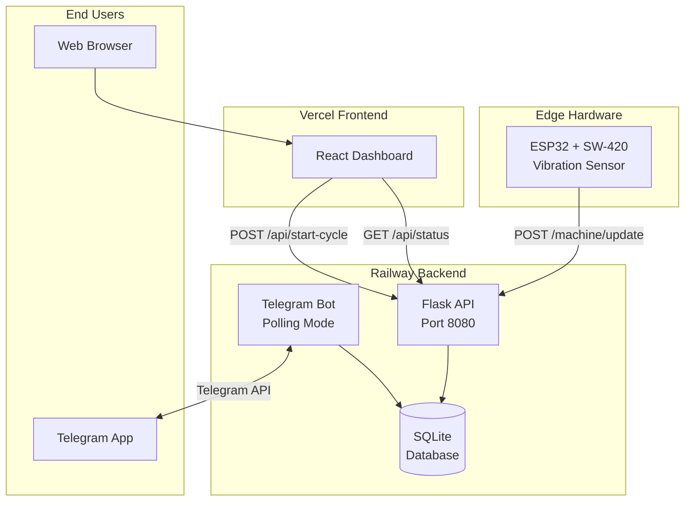

## 1. Architecture Diagram

### ASCII Version (for README)
```
┌─────────────────────────────────────────────────────────────────────────────┐
│                              UWash Architecture                              │
└─────────────────────────────────────────────────────────────────────────────┘

  ┌───────────────┐                                     ┌───────────────────┐
  │   HARDWARE    │                                     │    FRONTEND       │
  │               │                                     │                   │
  │  ┌─────────┐  │      POST /machine/update           │  ┌─────────────┐  │
  │  │  ESP32  │  │ ──────────────────────────────────► │  │   React     │  │
  │  │   +     │  │         (X-API-Key header)          │  │  Dashboard  │  │
  │  │ SW-420  │  │                                     │  │  (Vercel)   │  │
  │  │ Sensor  │  │                                     │  └──────┬──────┘  │
  │  └─────────┘  │                                     │         │         │
  │               │                                     │         │ GET     │
  │  Detects      │                                     │         │ /api/   │
  │  vibration    │                                     │         │ status  │
  └───────────────┘                                     │         │         │
                                                        │         ▼         │
                         ┌──────────────────────────────┴─────────────────┐ │
                         │                                                │ │
                         │            RAILWAY BACKEND                     │ │
                         │                                                │ │
                         │  ┌────────────────┐    ┌───────────────────┐   │ │
                         │  │   Flask API    │    │   Telegram Bot    │   │ │
                         │  │   (Port 8080)  │    │   (Polling Mode)  │   │ │
                         │  │                │    │                   │   │ │
                         │  │  Endpoints:    │    │  Commands:        │   │ │
                         │  │  /machine/     │    │  /start           │   │ │
                         │  │    update      │    │  /select          │   │ │
                         │  │  /api/status   │    │  /status          │   │ │
                         │  │  /api/start-   │    │                   │   │ │
                         │  │    cycle       │    │  Sends alarm when │   │ │
                         │  └───────┬────────┘    │  timer expires    │   │ │
                         │          │             └─────────┬─────────┘   │ │
                         │          │                       │             │ │
                         │          ▼                       ▼             │ │
                         │  ┌─────────────────────────────────────────┐   │ │
                         │  │              SQLite Database            │   │ │
                         │  │  (Persisted via Railway Volume)         │   │ │
                         │  │                                         │   │ │
                         │  │  Tables: timers, house_preferences,     │   │ │
                         │  │          alarms                         │   │ │
                         │  └─────────────────────────────────────────┘   │ │
                         │                                                │ │
                         └────────────────────────────────────────────────┘ │
                                                        │                   │
                                                        └───────────────────┘

  ┌───────────────┐
  │    USERS      │
  │               │
  │  ┌─────────┐  │     Telegram Messages
  │  │  Phone  │  │ ◄────────────────────────────────────────────────────────
  │  │  with   │  │
  │  │Telegram │  │
  │  └─────────┘  │
  └───────────────┘
```

### Mermaid Code 

